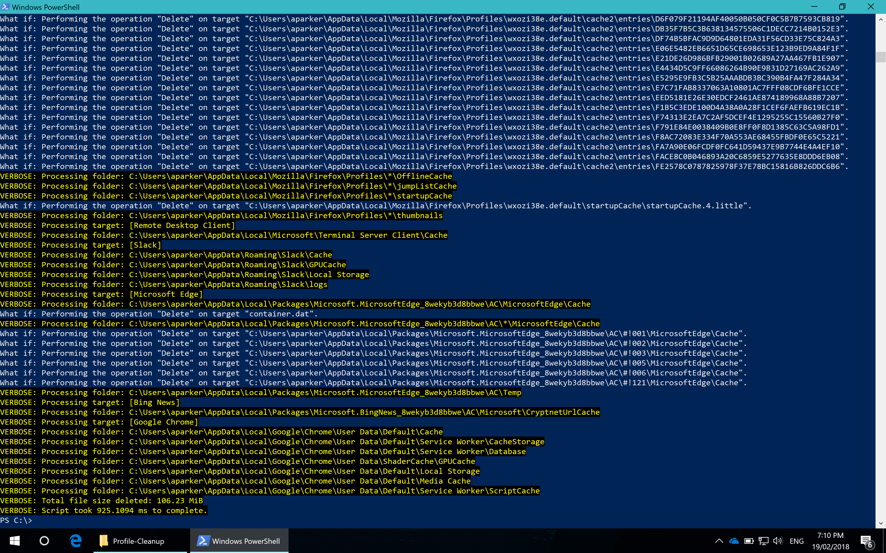
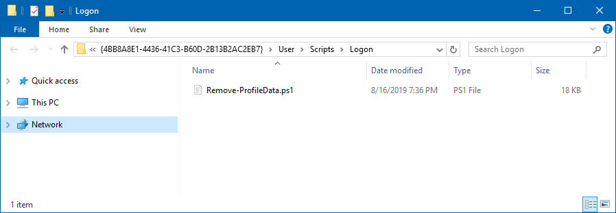

# Profile Cleanup script

!!! warning "Warning"
    This script will **DELETE** target files and folders. Be certain that the targets listed in the XML are OK to be removed. Test and test again before putting the script into production.

## Profile Capacity Management

A full discussion on managing Profile Container size can be found in this article: [A Practical Guide to FSLogix Containers Capacity Planning and Maintenance](https://stealthpuppy.com/fslogix-containers-capacity/).

## About Remove-ProfileData.ps1

`Remove-ProfileData.ps1` is used to delete files and folders in the user profile to reduce profile size, thus keeping Profile Containers sizes to a minimum. The script runs within the user session and reads an XML file that defines a list of files and folders to remove from the profile.

Actions on a target path can be:

* Prune - the XML can include a number that defines the age in days for last write that the file must be older than to be deleted. Essentially reducing the size of the folder.
* Delete - the target path will be deleted. Where the administrator may want to remove a target path, the Delete action will delete the entire folder.
* Trim - where the target path contains sub-folders, this action will remove all sub-folders except for the newest folder.

Supports `-WhatIf` and `-Verbose` output and returns a list of files removed from the profile. Add `-Verbose` will output the total size of files removed from the user profile and processing time at the end of the script. All targets (files / folders) that are deleted, will be logged to a file.

Deleting files from the profile can potentially result in data loss, so testing is advised and the use of `-Confirm:$False` is required for the script perform a delete.

`Remove-ProfileData.ps1` and supporting files are available on in [the repository on GitHub](https://github.com/aaronparker/fslogix/tree/main/Profile-Cleanup).

### Usage

To enable the script to report on what would be removed from user's profile, the following example command would be run in the user's context:

```powershell
.\Remove-ProfileData.ps1 -Targets .\targets.xml -WhatIf
```

To enable the script to clean up the user's profile, the following example command would be run:

```powershell
.\Remove-ProfileData.ps1 -Targets .\targets.xml -Confirm:$False
```



The age of files specified in the XML can be overridden with the `-Override` switch. This will remove files of any ages as specificed in the XML targets file.

```powershell
.\Remove-ProfileData.ps1 -Targets .\targets.xml -Confirm:$False -Override
```

By default, logs are kept for files that are deleted in %LocalAppData% and up to 30 logs will be kept. This number can be changed with the -KeepLog parameter.

```powershell
.\Remove-ProfileData.ps1 -Targets .\targets.xml -Confirm:$False -LogPath $env:AppData -KeepLog 7
```

### Running Remove-ProfileData.ps1

`Remove-ProfileData.ps1` is be run in the user session which could be done in several ways:

* A logon script - the script can be run to prune the user profile during login; however, consider potential login storms and impacts on IO and CPU
* A scheduled task - configure Windows Task Scheduler to run the script as the logged on user. Consider using task schedule trigger and condition properties to stagger the task across multiple users or desktop
* A logoff script - run the script during user logoff where applications are typically closed and user logoff actions are likely to be staggered

#### Group Policy Logon / Logoff

To run `Remove-ProfileData.ps1` in a Group Policy login or logoff script action, create a new GPO (or edit an existing GPO) to add `Remove-ProfileData.ps1` as a script.

* Open the *User Configuration / Policies / Windows Settings / Scripts (Logon/Logoff)* node. Edit either Logon or Logoff
* Click the `PowerShell Scripts` tab and click the *Show Files* button. Copy `Remove-ProfileData.ps1` into the location displayed in Explorer.



* Edit `Remove-ProfileData.ps1` and make the following changes:
  * Remove `ConfirmImpact = 'High'` (approximately line 49, starting with `CmdletBinding`)
  * Change `Mandatory = $True` to `Mandatory = $False` for the `Targets` parameter (approximately line 53)

* Copy `Targets.xml` to a central location. The `NETLOGON` share is a good candidate to ensure that the file is available centrally


* Add `Remove-ProfileData.ps1` as a script with the `-Targets` parameter (e.g. `-Targets "\\home.stealthpuppy.com\NETLOGON\ProfileTargets.xml"`)


Link the GPO to an organisational unit containing target user accounts (or use where the GPO is linked to a computer OU with [Loopback](https://support.microsoft.com/en-au/help/231287/loopback-processing-of-group-policy) enabled).
